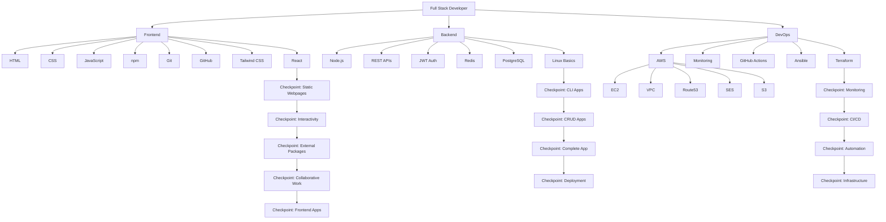

# Table of Contents

- #full-stack-developer-roadmap
  - #frontend-development
    - #html
    - #css
    - #javascript
    - #npm
    - #git
    - #github
    - #tailwind-css
    - #react
  - #backend-development
    - #nodejs
    - #postgresql
    - #restful-apis
    - #jwt-authentication
    - #redis
  - #devops
    - #linux-basics
    - #basic-aws-services
      - #route-53
      - #ses
      - #ec2
      - #vpc
      - #s3
    - #monit
    - #github-actions
    - #ansible
    - #terraform

# Full-Stack Developer Roadmap

A full-stack developer is responsible for building both the frontend and backend parts of a web application. This roadmap covers the essential tools, technologies, and concepts required to become a full-stack developer.

---

## Frontend Development

Frontend development focuses on the user-facing part of a web application. It includes building layouts, styling components, handling user interactions, and connecting the UI with backend services.

### HTML

HTML stands for HyperText Markup Language. It is the standard markup language used to structure content on the web.

Topics to learn:

- Basic HTML document structure
- Elements and tags
- Forms and inputs
- Semantic HTML
- Tables
- Accessibility basics
- SEO-friendly markup

### CSS

CSS stands for Cascading Style Sheets. It is used to style HTML elements and create responsive layouts.

Topics to learn:

- Selectors
- Box model
- Colors and typography
- Flexbox
- CSS Grid
- Positioning
- Media queries
- Responsive design
- Animations and transitions

### JavaScript

JavaScript is the programming language of the web. It allows you to create dynamic and interactive web pages.

Topics to learn:

- Variables
- Data types
- Functions
- Arrays and objects
- DOM manipulation
- Events
- ES6+ features
- Promises
- Async and await
- Fetch API
- Error handling

### npm

npm stands for Node Package Manager. It is used to install, manage, and share JavaScript packages.

Topics to learn:

- Installing packages
- `package.json`
- Dependencies and devDependencies
- npm scripts
- Semantic versioning
- Updating packages
- Removing packages

### Git

Git is a distributed version control system used to track changes in source code.

Topics to learn:

- Repositories
- Commits
- Branches
- Merging
- Rebasing
- Stashing
- Resolving conflicts
- Git workflow basics

### GitHub

GitHub is a cloud-based platform for hosting Git repositories and collaborating with other developers.

Topics to learn:

- Creating repositories
- Pushing code to GitHub
- Pull requests
- Issues
- Code reviews
- Branch protection
- GitHub Pages
- Collaboration workflows

### Tailwind CSS

Tailwind CSS is a utility-first CSS framework used to build modern and responsive interfaces quickly.

Topics to learn:

- Utility classes
- Responsive design
- Custom themes
- Layout utilities
- Typography
- Colors and spacing
- Hover and focus states
- Component styling
- Tailwind configuration

### React

React is a JavaScript library for building user interfaces, especially single-page applications.

Topics to learn:

- Components
- JSX
- Props
- State
- Events
- Conditional rendering
- Lists and keys
- Forms
- Hooks
- `useState`
- `useEffect`
- Context API
- React Router
- Component composition

---

## Backend Development

Backend development focuses on server-side logic, databases, APIs, authentication, and application infrastructure.

### Node.js

Node.js is a JavaScript runtime that allows developers to run JavaScript on the server.

Topics to learn:

- Node.js basics
- Modules
- File system
- HTTP module
- Event loop
- Streams
- Environment variables
- Error handling
- Building servers

### PostgreSQL

PostgreSQL is a powerful open-source relational database system.

Topics to learn:

- Tables
- Rows and columns
- Data types
- Primary keys
- Foreign keys
- SQL queries
- Joins
- Indexes
- Constraints
- Transactions
- Database normalization

### RESTful APIs

RESTful APIs allow frontend and backend applications to communicate using HTTP methods.

Topics to learn:

- REST principles
- HTTP methods
  - GET
  - POST
  - PUT
  - PATCH
  - DELETE
- Status codes
- Request and response structure
- API routes
- Query parameters
- Path parameters
- Error responses
- API documentation

### JWT Authentication

JWT stands for JSON Web Token. It is commonly used for securely transmitting authentication information between client and server.

Topics to learn:

- Authentication vs authorization
- JWT structure
- Access tokens
- Refresh tokens
- Token expiration
- Secure token storage
- Middleware-based authentication
- Role-based access control

### Redis

Redis is an in-memory data store often used for caching, sessions, queues, and real-time features.

Topics to learn:

- Key-value storage
- Caching strategies
- Expiration and TTL
- Sessions
- Pub/Sub
- Rate limiting
- Redis with Node.js
- Common Redis commands

---

## DevOps

DevOps focuses on deployment, automation, monitoring, infrastructure, and improving the software delivery process.

### Linux Basics

Linux is widely used for servers and cloud infrastructure.

Topics to learn:

- Linux command line
- File system navigation
- File permissions
- Users and groups
- Package managers
- Processes
- Services
- SSH
- Shell scripting basics
- Logs

### Basic AWS Services

Amazon Web Services provides cloud infrastructure services used to deploy, scale, and manage applications.

Topics to learn:

- Cloud computing basics
- AWS console
- IAM basics
- Regions and availability zones
- Billing basics
- Security best practices

#### Route 53

Amazon Route 53 is a scalable DNS and domain management service.

Topics to learn:

- DNS basics
- Hosted zones
- A records
- CNAME records
- MX records
- Domain routing
- Health checks

#### SES

Amazon SES stands for Simple Email Service. It is used to send transactional and marketing emails.

Topics to learn:

- Email sending
- Verified identities
- SMTP credentials
- Email templates
- Bounce handling
- DKIM and SPF
- Sending limits

#### EC2

Amazon EC2 provides virtual servers in the cloud.

Topics to learn:

- Instances
- AMIs
- Instance types
- Key pairs
- Security groups
- SSH access
- Elastic IPs
- User data scripts

#### VPC

Amazon VPC stands for Virtual Private Cloud. It allows you to create isolated cloud networks.

Topics to learn:

- Subnets
- Route tables
- Internet gateways
- NAT gateways
- Security groups
- Network ACLs
- Public and private subnets

#### S3

Amazon S3 is an object storage service used to store files, images, backups, and static assets.

Topics to learn:

- Buckets
- Objects
- Permissions
- Bucket policies
- Static website hosting
- Versioning
- Lifecycle rules
- Public and private access

### Monit

Monit is a monitoring tool used to manage and monitor processes, files, directories, and system resources.

Topics to learn:

- Installing Monit
- Monitoring services
- Restarting failed processes
- Email alerts
- Resource monitoring
- Monit configuration files
- Web interface

### GitHub Actions

GitHub Actions is a CI/CD tool built into GitHub. It is used to automate testing, building, and deployment workflows.

Topics to learn:

- Workflows
- Jobs
- Steps
- Actions
- Events
- Secrets
- Environment variables
- Running tests
- Deployment pipelines
- CI/CD basics

### Ansible

Ansible is an automation tool used for configuration management, deployment, and server provisioning.

Topics to learn:

- Inventory files
- Playbooks
- Tasks
- Roles
- Variables
- Handlers
- Templates
- Ansible modules
- SSH-based automation

### Terraform

Terraform is an Infrastructure as Code tool used to provision and manage cloud infrastructure.

Topics to learn:

- Providers
- Resources
- Variables
- Outputs
- State files
- Modules
- Terraform init
- Terraform plan
- Terraform apply
- Terraform destroy
- Managing AWS infrastructure


# Table of Contents
- [Full-Stack Developer Roadmap](#FullStackDeveloperRoadmap)
    - Frontend-development
        - [HTML](#html)
        - CSS
        - JavaScript
        - npm
        - Git
        - Github
        - Tailwind CSS
        - React
    - Backend Development
        - Node.js
        - PostgresSQL
        - RESTful APIs
        - JWT-Authentication
        - Redis
    - DevOps
        - Linux Basics
        - Basic AWS Services
            - Route53
            - SES
            - EC2
            - VPC
            - S3
        - Monit
        - Github Actions
        - Ansible
        - Terraform


# Full-Stack Developer Roadmap <a name="FullStackDeveloperRoadmap"></a>

> A structured roadmap for becoming a Full-Stack Developer from beginner to deployment and DevOps.

---


## HTML <a name="html"></a>

- Semantic HTML
- Forms
- Accessibility Basics

## CSS

- Layouts
- Flexbox
- Grid
- Responsive Design

## JavaScript

- Variables
- Functions
- DOM Manipulation
- ES6+

## npm

- Package Management
- Installing Dependencies

## Git

- Version Control
- Branching
- Merging

## GitHub

- Repository Hosting
- Collaboration
- Pull Requests

## Tailwind CSS

- Utility-first CSS Framework
- Responsive UI Development

## React

- Components
- State Management
- Hooks
- Routing

## Frontend Checkpoints

### Checkpoint 1
Build Static Webpages

### Checkpoint 2
Add Interactivity using JavaScript

### Checkpoint 3
Use External Packages

### Checkpoint 4
Collaborative Development with Git & GitHub

### Checkpoint 5
Build Complete Frontend Applications

---

# Backend Development

Backend starts here. Node.js is recommended because you're already familiar with JavaScript. 【1-5a2156】

## Node.js

- Runtime Environment
- Modules
- File System
- Express.js

## RESTful APIs

- HTTP Methods
- Routing
- CRUD Operations
- API Design

## JWT Authentication

- Access Tokens
- User Authentication
- Authorization

## Redis

- Caching
- Session Storage

## PostgreSQL

- Relational Database
- SQL Queries
- Indexing

## Linux Basics

- Shell Commands
- Process Management
- File Permissions

## Backend Checkpoints

### Checkpoint 1
Build CLI Applications

### Checkpoint 2
Build CRUD Applications

### Checkpoint 3
Build a Complete Backend Application

### Checkpoint 4
Deploy the Application

---

# DevOps & Cloud

DevOps learning starts after backend fundamentals. 【1-5a2156】

## AWS Services

### EC2
Virtual Machines

### VPC
Networking & Security

### Route53
DNS Management

### SES
Email Services

### S3
Object Storage

## Monitoring

- Logs
- Metrics
- Alerts

## GitHub Actions

- CI/CD Pipelines
- Automation Workflows

## Ansible

- Configuration Management
- Server Provisioning

## Terraform

- Infrastructure as Code
- Cloud Resource Management

## DevOps Checkpoints

### Checkpoint 1
Monitoring

### Checkpoint 2
CI/CD

### Checkpoint 3
Automation

### Checkpoint 4
Infrastructure

---

# Learning Notes

- Practice consistently.
- Build projects at every checkpoint.
- Focus on understanding concepts through implementation.
- Deploy and monitor your applications.
- Continue exploring specialized Frontend, Backend, and DevOps roadmaps after completing this path. 【1-5a2156】

---

# Roadmap Visualization



## Learning Path Summary

```text
Frontend
├── HTML
├── CSS
├── JavaScript
├── npm
├── Git
├── GitHub
├── Tailwind CSS
└── React
    └── Frontend Projects

Backend
├── Node.js
├── REST APIs
├── JWT Authentication
├── Redis
├── PostgreSQL
└── Linux Basics
    └── Backend Projects

DevOps
├── AWS
│   ├── EC2
│   ├── VPC
│   ├── Route53
│   ├── SES
│   └── S3
├── Monitoring
├── GitHub Actions
├── Ansible
└── Terraform
    └── Infrastructure Projects
```